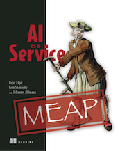

# AI As A Service

Welcome to the code repository for _AI As A Service_, a Manning book by Peter Elger and Eoin Shanaghy.

If you have yet to purchase the book, you can do so at [https://www.manning.com/books/ai-as-a-service](https://www.manning.com/books/ai-as-a-service). If you have, thank you! We hope you enjoy reading it and learning from it.

Here you will find the code examples for:

* [Chapter 2](./chapter2)
* [Chapter 3](./chapter3)
* [Chapter 4](./chapter4)
* [Chapter 6](./chapter6)

## LiveBook Discussion

If you have purchased the book, we are grateful for your comments and feedback in the [Manning LiveBook Discussion Forum](https://livebook.manning.com/#!/book/ai-as-a-service/welcome/v-1/)

